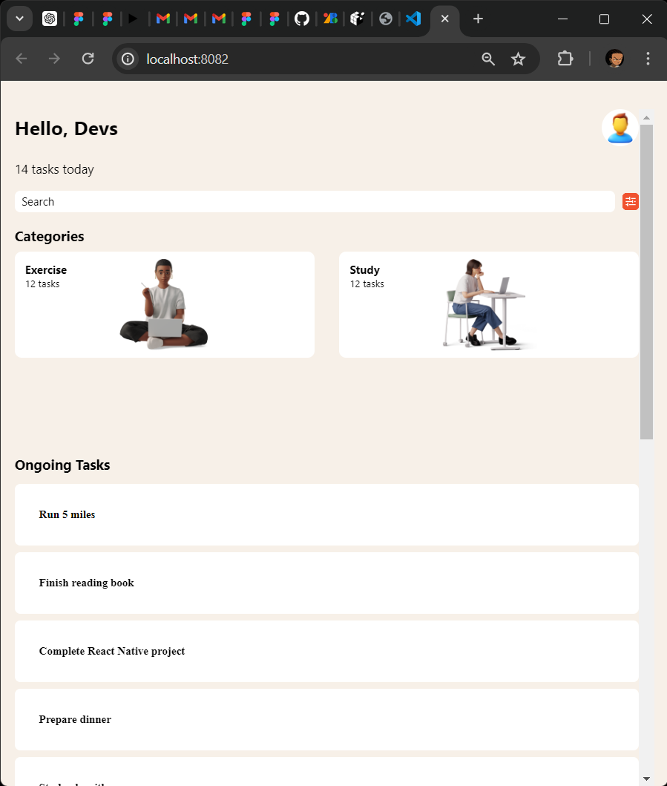

# Task Manager App

This application helps you manage your tasks across different categories such as Exercise, Study, Code, Cook, etc.

## Components

### App
- **Usage**: Main component that includes the header, category list, and task list.

### TaskList
- **Usage**: Renders the list of tasks with their respective categories and icons.

### Screenshots

